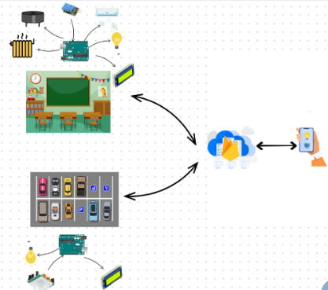
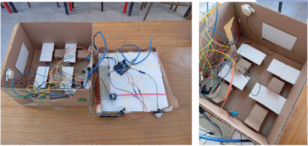
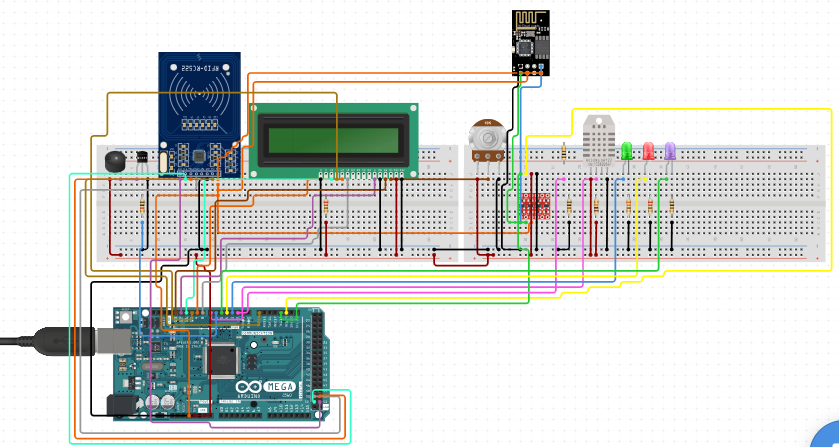
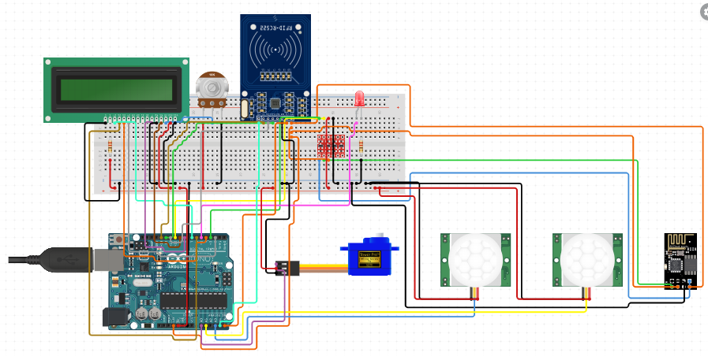
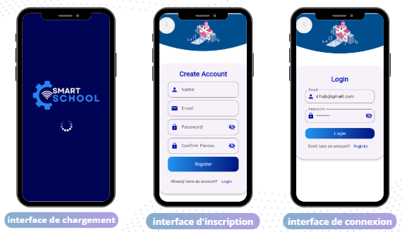
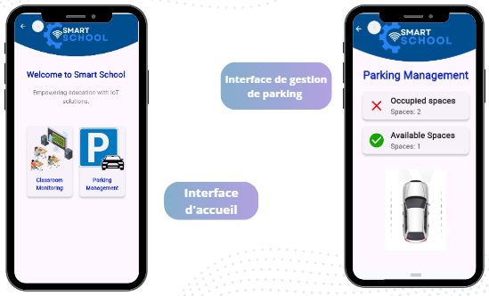
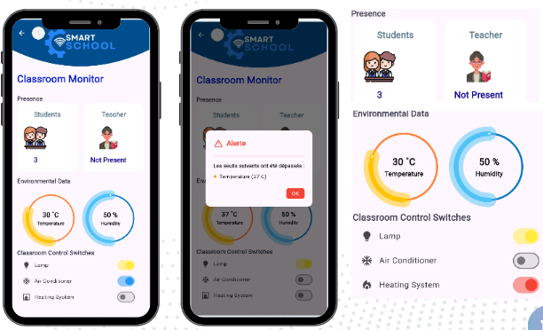

# Smart School System

## Description
Le projet **Smart School System** est une solution IoT innovante visant à moderniser les infrastructures scolaires. Il optimise la gestion des salles de classe, le suivi des élèves, et facilite la communication via une application mobile dédiée. De plus, il améliore la gestion des parkings en permettant la surveillance en temps réel de la disponibilité des places. Le système intègre des capteurs, un module Wi-Fi et Firebase pour offrir une expérience utilisateur fluide et intuitive.

## Fonctionnalités
### Smart Class
- Surveillance en temps réel des conditions de la classe (température, humidité, etc.).
- Contrôle automatique de l’éclairage, de la climatisation et du chauffage.
- Système RFID pour enregistrer la présence des élèves.
- Notifications visuelles et sonores pour signaler des alertes ou des états.
- Communication entre le matériel IoT et l’application via le module Wi-Fi.

### Smart Parking System
- Détection en temps réel du nombre de places de stationnement disponibles.
- Transmission des données collectées vers Firebase pour stockage et traitement.
- Accès à une application mobile permettant de visualiser l'état du parking.

## Architecture
L’architecture du système inclut les éléments suivants :
1. **Capteurs IoT** : Surveillance des paramètres environnementaux.
2. **Module Wi-Fi** : Transmission des données vers Firebase.
3. **Firebase** : Stockage cloud en temps réel.
4. **Application Mobile** : Interface utilisateur pour surveiller et gérer le système.

## Matériel Utilisé
### Composants Principaux
- **Arduino UNO** : Microcontrôleur principal pour le traitement des données.
- **Module Wi-Fi (ESP8266/ESP32)** : Connectivité réseau.
- **Capteurs (DHT11, RFID, etc.)** : Collecte de données.
- **Afficheur LCD** : Affichage des informations en temps réel.
- **LEDs et Buzzer** : Signalisations visuelles et sonores.

### Technologies Logicielles
- Arduino IDE pour la programmation des microcontrôleurs.
- Firebase pour la gestion des données cloud.
- Flutter pour le développement de l’application mobile.

## Aperçu
### Smart School System Architecture

Cette image présente l'architecture globale du Smart School System, illustrant l'intégration des capteurs IoT, des modules Wi-Fi et de Firebase pour une gestion intelligente des ressources scolaires et de stationnement.

### Schéma réel du circuit électronique réalisé pour le système pour le Smart School System

Voici le schéma réel du circuit électronique développé pour le Smart School System, représentant la configuration matérielle et les composants utilisés pour assurer le bon fonctionnement du système.

### Schéma électronique Smart Class

Ce schéma montre les éléments électroniques impliqués dans la gestion des salles de classe intelligentes, y compris les capteurs et dispositifs pour suivre l'occupation des salles et la présence des élèves.

### Schéma électronique Smart Parking

Illustration du schéma électronique utilisé pour la gestion du parking intelligent, avec des capteurs permettant de suivre la disponibilité des places de stationnement en temps réel.

### Interfaces de chargement et d'authentification

Cette image montre l'interface de chargement et d'authentification de l'application mobile, permettant aux utilisateurs de se connecter de manière sécurisée au système.

### Interfaces d'accueil et de gestion de parking

L'interface d'accueil et de gestion de parking présente les informations en temps réel sur la disponibilité des places de stationnement, offrant une vue claire et accessible de l'état du parking.

### Interfaces gestion de classe intelligente

Cette interface permet de gérer la salle de classe intelligente, en affichant les informations relatives à l'occupation des salles, le suivi des élèves et la gestion des ressources (température, humidité, etc.).

## Auteurs
**Cherni Rihab** 
**Benhamed Ranime** 
**Sidi Mohamed Ahmed** 
(Étudiants en génie informatique à l'ENSIT (NTS)).
